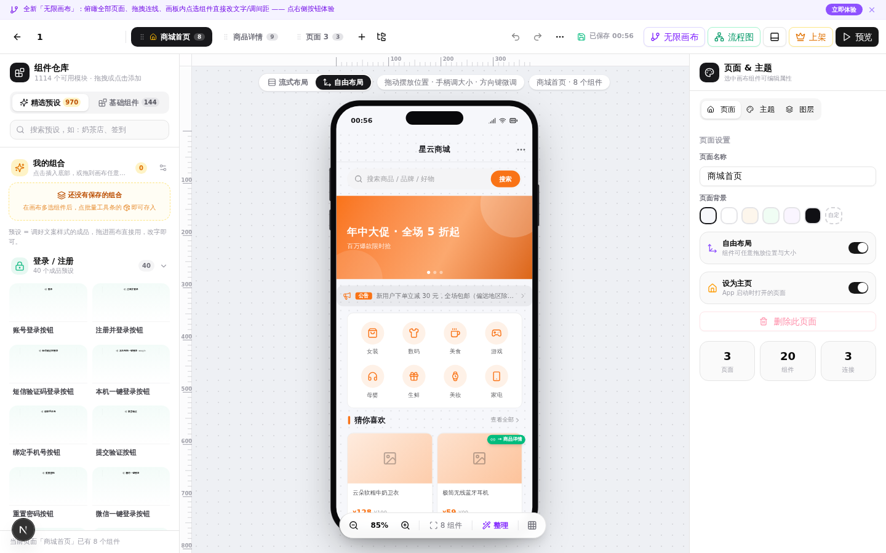
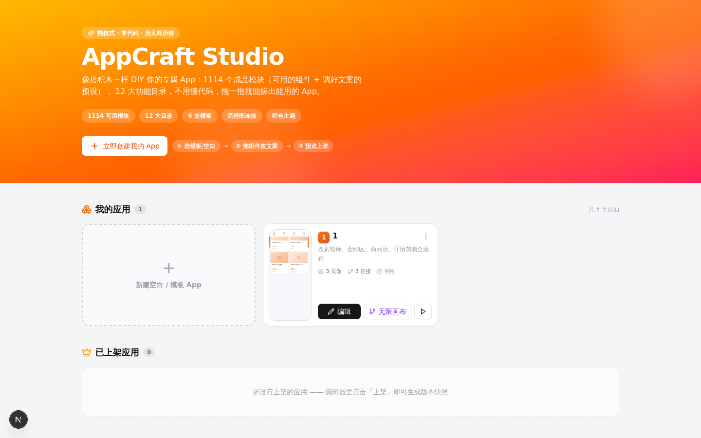
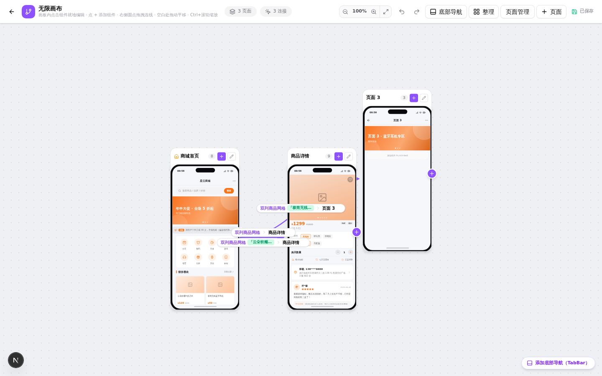
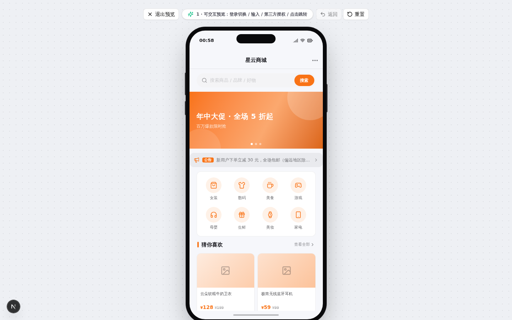
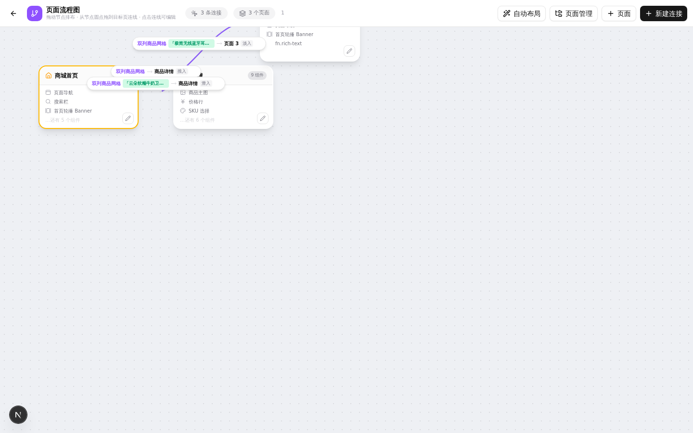

<div align="center">

# 🛠️ AppCraft Studio

**像搭积木一样，拖拽出你的专属 App —— 零代码 · 所见即所得**

拖组件 → 改文案 → 连页面 → 一键预览上架。小白也能 10 分钟搓出一个能用的 App。

[](https://nextjs.org)
[](https://www.typescriptlang.org)
[](https://tailwindcss.com)
[](https://www.prisma.io)
[](https://turso.tech)
[](#-功能特性)
[](#-license)



*↑ 组件仓库 1114 个成品模块 · 自由布局画布 · 手机壳实时预览 · 属性面板逐件编辑*

</div>

---

## ✨ 功能特性

### 🧩 1114+ 成品模块，开箱即用
- **155 个基础组件** × 13 个功能目录（商城、外卖点餐、社区动态、经营看板、健身打卡、新闻资讯……）
- **970 个精选预设**：调好真实文案的组件成品，拖进画布改几个字就是你的页面
- 金刚区、商品网格、限时秒杀、直播间、KPI 看板、课程表、日程……覆盖主流 App 形态

### 🖱️ 点谁编谁 —— 每个条目都是独立个体
- 画布上**点击商品网格里的任意一件商品** → 弹窗里只有那一件（名称/售价/原价/已售），独立编辑、独立绑定跳转页面
- 金刚区格子、秒杀位、订单宫格、设置行同理：**点谁编谁，无缝切换**
- 同一个页面可以被**多个触发组件指向**（多对一）：商品 A 的主图和首页 Banner 都能跳同一个详情页

### 🕸️ 无限画布 · 流程图式页面编排
- 俯瞰全部页面，右侧圆点拖拽连线即完成页面跳转绑定
- 多条连线自动扇形展开，槽位徽章标注触发条目（如「夏日限定碎花连衣裙」）
- 画板内点选组件直接就地编辑，不离开画布改完文字

### 📱 预览即真机
- 手机壳内实时预览，点击交互、页面转场动画（滑入/淡入/展开）与真实 App 一致
- 底部 TabBar、昼夜主题切换、点赞收藏等本地动作全部可用
- 一键**导出 HTML**，随手分享

### 🚀 小白三步上手
1. 选模板 / 一键铺满套装（商城首页、社区动态、经营看板示例套装）
2. 拖组件、改文案
3. 点预览，上架分享

## 🖼️ 界面速览

| 首页 | 无限画布 |
|:---:|:---:|
|  |  |
| **真机预览** | **流程图连接** |
|  |  |

## 🧰 技术栈

| 层 | 选型 |
|---|---|
| 框架 | Next.js 16（App Router）+ React 19 + TypeScript 5 |
| 样式 | Tailwind CSS 4 + shadcn/ui（New York）+ Lucide Icons |
| 状态 | Zustand（编辑器状态）+ TanStack Query |
| 数据库 | Prisma ORM —— 本地 SQLite / 线上 [Turso](https://turso.tech)（libSQL）双模式 |
| 运行时 | Node.js ≥ 20 / Bun |

## 🚀 本地开发

```bash
git clone https://github.com/guyuejunbiao/appcraft-studio.git
cd appcraft-studio
bun install                # 或 npm install

# 初始化数据库（SQLite，默认 file:./db/custom.db）
bun run db:generate
bun run db:push

bun run dev                # http://localhost:3000
```

> 不装 Bun 也可以：把 `bun` 换成 `npx` / `npm run` 即可。

## ☁️ 部署到 Vercel（Turso 托管数据库）

Serverless 平台文件系统不持久，线上部署请用 Turso（libSQL，SQLite 兼容，免费额度足够跑起来）。代码已内置双模式：**配置了 `TURSO_DATABASE_URL` 就走 Turso，没配置就走本地 SQLite**，代码零改动。

### 1️⃣ 创建 Turso 数据库

```bash
# 安装 Turso CLI
curl -sSfL https://get.tur.so/install.sh | bash
turso auth login

turso db create appcraft-studio
turso db show appcraft-studio --url      # → TURSO_DATABASE_URL（libsql://...）
turso db tokens create appcraft-studio   # → TURSO_AUTH_TOKEN
```

### 2️⃣ 建表（把 Prisma Schema 推到 Turso）

Prisma CLI 不能直连 `libsql://`，用官方姿势「生成 SQL → turso shell 执行」：

```bash
# 生成建表 SQL
bunx prisma migrate diff --from-empty --to-schema-datamodel prisma/schema.prisma --script > schema.sql

# 写入 Turso
turso db shell appcraft-studio < schema.sql
```

### 3️⃣ 部署 Vercel

1. 把本仓库推到你的 GitHub，[vercel.com/new](https://vercel.com/new) 导入仓库（Framework 自动识别 Next.js）
2. 环境变量（Project → Settings → Environment Variables）：

   | 变量 | 值 |
   |---|---|
   | `TURSO_DATABASE_URL` | `libsql://appcraft-studio-<你的org>.turso.io` |
   | `TURSO_AUTH_TOKEN` | 第 1 步生成的 token |

3. Deploy 🚀 —— 构建脚本已内置 `prisma generate`，无需额外配置

### 本地连 Turso 调试（可选）

```bash
TURSO_DATABASE_URL=libsql://... TURSO_AUTH_TOKEN=... bun run dev
```

## 📁 项目结构

```
src/
├── app/                    # Next.js App Router（页面 + API 路由）
├── components/
│   ├── builder/            # 编辑器：画布/无限画布/属性面板/连线/页面管理
│   ├── widgets/            # 155 个基础组件（按目录分文件）
│   └── ui/                 # shadcn/ui 基础组件
├── lib/
│   ├── presets/            # 970 个精选预设（22 目录）
│   ├── db.ts               # Prisma 客户端（SQLite / Turso 双模式）
│   ├── types.ts            # 页面/组件/连接 数据模型
│   └── store.ts            # Zustand 编辑器状态
└── prisma/schema.prisma    # Project / Page / Connection / WidgetPreset
```

## 📄 License

[MIT](LICENSE) © guyuejunbiao
